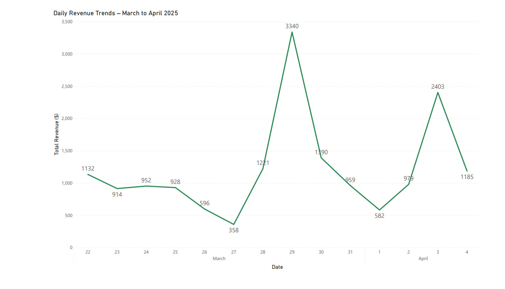
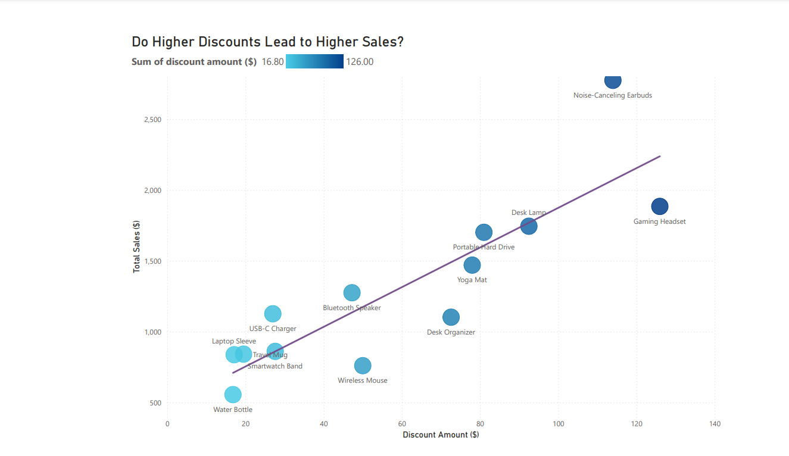

# Shopify Sales Dashboard

> 🚀 **Instant Plug-and-Play Shopify Dashboard**
>
> This analytics dashboard can be immediately connected to **any Shopify store**. Simply provide your Shopify credentials in the `.env` file, and your personalized sales dashboard will be ready in minutes.

---

## 📊 [View the Complete Shopify Dashboard](docs/shopify_dashboard.pdf)

---

## Quick Visual Preview





---

## Quick Navigation

- [Project Overview](#-project-overview)
- [Key Metrics & Business Questions Answered](#-key-metrics--business-questions-answered)
- [Quick Start](#-quick-start-instant-usage)
- [Features](#-features)
- [Tech Stack](#️-tech-stack)
- [Project Structure](#-project-structure)
- [Getting Started](#-getting-started)
- [Toggle Between Real and Synthetic Data](#toggle-between-real-and-synthetic-data)
- [Running the Project](#️-running-the-project)
- [Running the Streamlit Dashboard](#-running-the-streamlit-dashboard)
- [Airflow Automation](#️-airflow-automation)
- [Data Sources & ETL Pipeline](#-data-sources--etl-pipeline)
- [Daily Data Generation](#-daily-data-generation-simulated-shopify-data)
- [Data Quality and Failure Simulation](#-data-quality--failure-simulation)
- [Automated Future Date Error Correction DAG](#️-automated-future-date-error-correction-dag)
- [Why Choose This Dashboard over Shopify's Built-In Analytics?](#-why-choose-this-dashboard-over-shopifys-built-in-analytics)
- [Note on Analytical Insights & Human Behavior](#-note-on-analytical-insights--human-behavior)
- [Visualizations](#-visualizations)
- [Shopify API Reference](#-shopify-api-reference)
- [Troubleshooting](#️-troubleshooting)
- [Future Enhancements](#-future-enhancements)
- [Recent Updates](#-recent-updates)

---

## 🧭 Project Overview

The **Shopify Sales Dashboard** is a portfolio-ready analytics dashboard specifically designed for Shopify merchants and analytics professionals. It demonstrates end-to-end capabilities in data extraction, transformation, loading (ETL), and visualization, to answer practical business questions:

- **Sales Performance:** Quickly track total revenue, average order values (AOV), and top-performing products.
- **Customer Insights:** Analyze order patterns, repeat purchase rates, and customer segments.
- **Trends and Patterns:** Clearly visualize daily and monthly sales trends, enabling actionable business decisions around conversion and customer retention.

Built using **Python, Streamlit, PostgreSQL, and Airflow**, this project highlights modern data analytics skills, professional dashboard development, and practical business-oriented thinking.

---

## 🎯 Key Metrics & Business Questions Answered

This dashboard tracks essential e-commerce metrics and answers key business questions:

**Key Metrics:**

- 📈 **Total Sales Revenue**
- 🛒 **Average Order Value (AOV)**
- 📊 **Total Number of Orders**
- 💎 **Customer Lifetime Value (CLV)**
- 🔄 **Returning vs. New Customers**
- 🏅 **Top-selling Products**
- 🚀 **Sales Growth Rate (weekly/monthly)**

**Business Questions Answered:**

1. **Sales Performance:**

   - How are total sales trending over time?
   - What's the average order value (AOV), and is it improving?

2. **Customer Insights:**

   - Who are the most valuable customers (high CLV)?
   - What's the ratio of returning to new customers?

3. **Product Insights:**

   - Which products contribute most to revenue?
   - Are there clear seasonal trends or unexpected surges?

4. **Operational Effectiveness:**
   - Are discounts effectively driving sales?
   - Which shipping methods are customers preferring?

**Note:**  
Due to synthetic data constraints, some visualizations may initially appear less realistic. When connected to real Shopify data, the dashboard accurately and clearly addresses all questions outlined above.

---

## ⚡ Quick Start (Instant Usage)

Follow these steps to set up and launch the **Shopify Sales Dashboard** quickly:

### 📋 Requirements

- Python 3.8 or higher
- PostgreSQL
- Docker (optional, recommended)

### 🔧 Setup Instructions

**1. Clone the Repository:**

```
git clone https://github.com/NicolasLevesque/shopify-sales-dashboard.git
cd shopify-sales-dashboard
```

**2. Set Up Python Environment:**

Create a virtual environment (recommended):

```
python -m venv venv
source venv/bin/activate # Linux/macOS
.\venv\Scripts\activate # Windows
```

Install required packages:

```
pip install -r requirements.txt
```

**3. Configure Environment Variables:**

Rename the `.env.example` file to `.env`:

```
cp .env.example .env
```

Configure the `.env` file:

- To use synthetic data (recommended for initial exploration), set:
  ```
  USE_REAL_SHOPIFY_DATA=false
  ```
- To use real Shopify data, provide Shopify API credentials:
  ```
  USE_REAL_SHOPIFY_DATA=true
  SHOPIFY_API_KEY="your_api_key"
  SHOPIFY_PASSWORD="your_api_password"
  SHOPIFY_STORE_NAME="your_store_name"
  ```

### ▶️ Running the Dashboard

Make sure your data pipeline (Airflow DAG or synthetic data script) has run and populated the database.

Start the Streamlit app:

```
streamlit run app.py
```

Access the dashboard by opening your browser and navigating to `http://localhost:8501`.

### 🔄 Switching Data Sources

You can easily switch between synthetic and real Shopify data by modifying the `USE_REAL_SHOPIFY_DATA` variable in your `.env` file and restarting the dashboard.

---

## 📌 Features

- **Automated Data Extraction:** Real-time Shopify data extraction via Shopify API.
- **Robust ETL Pipeline:** Automated data cleaning & transformation with Python, Pandas, and SQL.
- **Flexible Data Storage:** Supports PostgreSQL and Google BigQuery databases.
- **Scheduled Automation:** ETL processes automated daily using Apache Airflow.
- **Interactive Visualizations:** Dashboards created in Power BI, Tableau, or Streamlit.
- **Email Notifications:** Alerts on ETL pipeline failures via SMTP.
- **Secure Configuration:** Environment variables (no hardcoded credentials).

---

## 🛠️ Tech Stack

- **Programming:** Python, SQL
- **Data Processing:** Pandas, dbt, SQLAlchemy
- **Automation & Scheduling:** Apache Airflow
- **Databases:** PostgreSQL, Google BigQuery
- **Visualization:** Power BI, Tableau, Streamlit
- **API Integration:** Shopify REST API

---

## 📂 Project Structure

- **dags/**: Contains Airflow DAG files for scheduling tasks.
- **scripts/**: Holds ETL Python scripts for data extraction and processing.
- **dashboards/**: Storage location for Power BI/Tableau/Streamlit dashboard files.
- **data/**: Optional storage for raw or intermediate data files.
- **logs/**: Airflow-generated logs (not committed to GitHub).
- **config/**: Contains configuration-related files (e.g., Airflow settings).

---

## 🚧 Getting Started

### Clone the Repository

```bash
git clone https://github.com/NicolasLevesque/shopify-sales-dashboard.git
cd shopify-sales-dashboard
```

### Install Dependencies

Ensure you're using Python 3.8 or later, then run:

```bash
pip install -r requirements.txt
```

> If using Docker, dependencies will be installed automatically by your Docker container.

### Set Up Environment Variables

Copy the `.env.example` file to `.env` in your project root, then update it with your credentials:

```bash
# Shopify Credentials
SHOP_NAME=your-shop-name
ADMIN_ACCESS_TOKEN=your-shopify-access-token

# PostgreSQL Credentials
POSTGRES_DB=shopify_data
POSTGRES_USER=postgres
POSTGRES_PASSWORD=your-db-password
POSTGRES_HOST=localhost
POSTGRES_PORT=5432
```

> For Docker, you may need to use `POSTGRES_HOST=postgres` or `host.docker.internal`.

---

## Toggle Between Real and Synthetic Data

This project supports both real Shopify data and synthetic data for development and testing purposes. You can switch between these data sources by modifying the `USE_REAL_SHOPIFY_DATA` environment variable in your `.env` file.

### Using Real Shopify Data:

- Set `USE_REAL_SHOPIFY_DATA=True` in your `.env` file.
- Ensure your Shopify API credentials are correctly configured in the `.env` file.
- Rebuild and restart your Docker containers to apply the changes:

```
docker-compose down
docker-compose up --build -d
```

### Using Synthetic Data:

- Set `USE_REAL_SHOPIFY_DATA=False` in your `.env` file.
- Rebuild and restart your Docker containers to apply the changes:

```
docker-compose down
docker-compose up --build -d
```

---

## ▶️ Running the Project

### Run ETL Manually

To manually run your ETL script (without Airflow):

```bash
python scripts/real_shopify_etl.py
```

Look for the confirmation message `✅ ETL Load Complete` in your console.

Verify data loaded successfully into your database:

```bash
docker exec -it shopify_sales_dashboard-postgres-1 psql -U airflow -d airflow

SELECT * FROM customers LIMIT 5;
SELECT * FROM orders LIMIT 5;
SELECT * FROM products LIMIT 5;
```

### Run ETL with Docker/Airflow

Launch your Docker environment and Airflow scheduler:

```bash
docker-compose up -d
```

Then, access the Airflow UI at [http://localhost:8080](http://localhost:8080), enable your DAG (`daily_shopify_etl`), and trigger it manually or let it run on schedule.

---

## 🚀 Running the Streamlit Dashboard

### Using Docker (Recommended)

If you're running your project with Docker Compose, the Streamlit dashboard automatically starts alongside Airflow:

- **Ensure your Docker containers are running**:

```bash
docker-compose up -d
```

- **Open your web browser and navigate to**:

[http://localhost:8501](http://localhost:8501)

This will display your interactive Streamlit dashboard connected directly to the PostgreSQL database, automatically reflecting new data from your Airflow pipeline.

---

### Without Docker (Manual Setup)

If you're running locally (without Docker):

- **Navigate to your dashboard directory** and run:

```bash
streamlit run app.py
```

- **Access the dashboard in your browser**:

[http://localhost:8501](http://localhost:8501)

Ensure your local environment is configured properly and your PostgreSQL instance is running.

---

## ⚙️ Airflow Automation

### Airflow Setup

1. **Software Dependencies:**

   - Docker & Docker Compose
   - Python (3.8+ recommended)
   - PostgreSQL (Docker-managed or standalone installation)

   Quick installation for Docker: [Install Docker](https://docs.docker.com/get-docker/)

2. **Start Docker Containers:**

   ```bash
   docker-compose up -d
   ```

3. **Verify Docker Containers:**

   ```bash
   docker ps
   ```

4. **Access Airflow Web Interface:**
   - Visit [http://localhost:8080](http://localhost:8080) and enable your DAG (`daily_shopify_etl`).

### Scheduling

- **Default schedule:** Runs daily at midnight (`@daily`).
- **Customize schedule:** Edit the `schedule_interval` parameter in your DAG file (`daily_shopify_etl.py`).

Example (run every 6 hours):

```bash
schedule_interval = '0 */6 * * *'
```

### Email Alerts

Set up email notifications for Airflow task failures:

1. **Configure SMTP settings** in your `.env`:

```bash
AIRFLOW__SMTP__SMTP_HOST=smtp.gmail.com
AIRFLOW__SMTP__SMTP_PORT=587
AIRFLOW__SMTP__SMTP_USER=your_email@gmail.com
AIRFLOW__SMTP__SMTP_PASSWORD=your_gmail_app_password
AIRFLOW__SMTP__SMTP_MAIL_FROM=your_email@gmail.com
```

2. **Add email settings** to your DAG (`daily_shopify_etl.py`):

```bash
default_args = {
  'email': ['your_email@gmail.com'],
  'email_on_failure': True,
}
```

---

## 📊 Data Sources & ETL Pipeline

**Data Source:**  
The project uses Shopify as its primary data source, leveraging the Shopify REST API to access sales, customer, and product data in real-time.

**ETL Pipeline:**  
The ETL process is managed by `scripts/real_shopify_etl.py`, which extracts data from Shopify, transforms and cleans it using Python and Pandas, and loads it into PostgreSQL.

- **Manual Execution:** Run locally with:

```bash
python scripts/real_shopify_etl.py
```

- **Airflow Automation:**  
  The Airflow DAG (`daily_real_shopify_etl.py`) automates the ETL pipeline daily at midnight (`@daily`). The DAG runs the ETL script, monitors its success, and sends email notifications upon failure.

You can trigger or monitor the DAG via the Airflow web interface:

- URL: [http://localhost:8080](http://localhost:8080)

---

## 📅 Daily Data Generation (Simulated Shopify Data)

To demonstrate and validate automated analytics capabilities without relying solely on a Shopify test store, the project includes a fully automated, daily-scheduled data generation pipeline using **Apache Airflow** and **Python’s Faker library**.

**What does this mean for the project?**

- Each day, realistic Shopify sales data (including randomized customer names, products, quantities, and pricing) is automatically appended to the dataset (`shopify_sales.csv`).
- The generated data is indistinguishable from typical real-world Shopify data, ensuring a robust demonstration environment for analytics and visualization.

### 🛠️ **How it works:**

- **Airflow DAG:**  
  Located at `dags/daily_shopify_data_generation.py`, this DAG generates daily fake transactions automatically.
- **Data Location:**  
  The generated data is stored directly in the PostgreSQL database (`synthetic_orders` table) and seamlessly integrates with existing dashboards and Airflow DAG workflows for efficient analytics and error correction.

### 🔄 **Daily Schedule:**

The default schedule for this data generation is set to run once per day (`@daily`). Customize the schedule by modifying the DAG’s `schedule_interval`.

**Example (run hourly):**

```python
schedule_interval = '@hourly'
```

This automation clearly highlights the project’s scalability and real-world applicability, offering a robust demonstration of daily-updated analytics workflows.

### Example Data Generated by Project

Below is a realistic sample of the synthetic Shopify orders data, (including generated errors (future dates, negative quantities, and missing prices), though currently the errors are being automatically corrected):

| order_id | order_date | customer_name      | customer_email              | product             | quantity | price | total_price | shipping_method | discount_code | taxes | shipping_cost | discount_amount | is_error |
| -------- | ---------- | ------------------ | --------------------------- | ------------------- | -------- | ----- | ----------- | --------------- | ------------- | ----- | ------------- | --------------- | -------- |
| 1073     | 2025-04-02 | Shane Nichols      | lopezjoshua@example.net     | Water Bottle        | 5        | 12.00 | 81.02       | Overnight       | WELCOME10     | 7.02  | 20.00         | 6.00            | False    |
| 1040     | 2025-04-02 | Kristopher Peck    | dominguezdeanna@example.com | Travel Mug          | 1        | 15.00 | 15.75       | Standard        | NULL          | 0.75  | 0.00          | 0.00            | False    |
| 1071     | 2025-04-02 | Megan Barnes       | carmenvaldez@example.com    | Portable Hard Drive | 4        | 45.00 | 189.00      | Standard        | NULL          | 9.00  | 0.00          | 0.00            | False    |
| 1072     | 2025-04-02 | Michael Simon      | pattersondiane@example.net  | Water Bottle        | 5        | 12.00 | 56.70       | Standard        | WELCOME10     | 2.70  | 0.00          | 6.00            | False    |
| 1038     | 2025-04-02 | James Thompson     | nicholas08@example.org      | Laptop Sleeve       | 1        | 18.00 | 17.01       | Standard        | WELCOME10     | 0.81  | 0.00          | 1.80            | False    |
| 1039     | 2025-04-02 | Raymond Walsh      | kgutierrez@example.org      | Water Bottle        | 4        | 12.00 | 60.40       | Express         | NULL          | 2.40  | 10.00         | 0.00            | False    |
| 1069     | 2025-04-02 | Christina Adams    | julie01@example.org         | USB-C Charger       | 4        | 10.00 | 62.00       | Overnight       | NULL          | 2.00  | 20.00         | 0.00            | False    |
| 1070     | 2025-04-02 | Heather Wilcox     | harrisonkristin@example.org | Portable Hard Drive | 1        | 45.00 | 67.25       | Overnight       | NULL          | 2.25  | 20.00         | 0.00            | False    |
| 1037     | 2025-04-02 | Jeffrey Marquez    | garzajavier@example.org     | Yoga Mat            | 2        | 30.00 | 84.80       | Overnight       | NULL          | 4.80  | 20.00         | 0.00            | False    |
| 1041     | 2025-04-02 | Jacqueline Johnson | gobrien@example.com         | Desk Organizer      | 2        | 22.00 | 66.20       | Overnight       | NULL          | 2.20  | 20.00         | 0.00            | False    |

---

## 🩺 Data Quality & Failure Simulation

In real-world data pipelines, unexpected issues can arise—such as incomplete rows, invalid dates, or negative quantities. To demonstrate robust data engineering practices, **this project introduces a small chance (~10%) of “bad data”** during daily synthetic order generation:

- **Examples of Induced Errors**:
  - **Missing or Negative Price** – Represents failed calculations or missing fields.
  - **Future Order Date** – Simulates incorrect timestamps or time-zone quirks.
  - **Negative Quantity** – Mimics data entry errors or faulty external integrations.

Each problematic row is marked with a boolean flag, `is_error = TRUE`, so you can easily **isolate** and **remediate** them—mirroring real-world data quality workflows (e.g., quarantining bad records, applying correction scripts, or sending alerts). The pipeline **still runs** seamlessly, showcasing how to handle data anomalies gracefully without halting the entire ETL process.

- 💡 **Simulated “failures”** reveal how you might track and fix flawed input.
- ⚙️ **No disruption** to the main pipeline—only flagged rows need cleanup if desired.

---

## 🛠 Automated Data Error Detection & Correction DAG

An Airflow DAG (`fix_shopify_data_errors`) is implemented to automatically detect and correct simulated data errors introduced during daily synthetic data generation:

**✅ Automated Error Types Corrected:**

- **Future Order Dates** – Adjusted to today's date to ensure accuracy.
- **Negative Quantities** – Corrected by converting to absolute (positive) values.
- **Missing Prices** – Filled in with realistic, product-based average prices.

Each correction is clearly logged in Airflow task logs for easy monitoring and verification.

**Schedule**: Automatically triggered daily after the data generation DAG completes.

**Usage**: Monitor corrections directly in Airflow's UI or through your dashboard's visual analytics, ensuring data reliability and integrity.

---

## 🚀 Why Choose This Dashboard over Shopify's Built-In Analytics?

While Shopify's built-in analytics provides basic metrics, this dashboard aims to deliver advanced, actionable insights designed specifically to grow your business. Future planned enhancements include:

- **🎯 Advanced Customer Segmentation (RFM Analysis):**  
  Quickly identify your most valuable customers and target them effectively.

- **⚠️ Automated Anomaly Detection & Alerts:**  
  Receive automatic notifications when unexpected trends or data irregularities are detected.

- **📈 Predictive Analytics & Forecasting:**  
  Leverage forecasting models to anticipate sales trends and inventory requirements.

- **🖥️ Interactive & Customizable Dashboards:**  
  Tailor-made, drill-down visualizations built in Power BI, Tableau, or Streamlit.

- **🔄 Completely Hands-Free Automation:**  
  Fully automated workflows—from data ingestion to dashboard updates—without manual intervention.

_Note:_ These features are in active development. Updates will be clearly communicated as features are implemented.

---

## 🔍 Note on Analytical Insights & Human Behavior

This dashboard uses synthetic data generated daily for the purpose of demonstrating technical automation, analytics pipelines, and visualization capabilities.

### While effective for showcasing technical processes, synthetic data does not inherently reflect authentic human psychological patterns, motivations, or behaviors. Genuine psychological insights and strategic recommendations require validation and analysis of authentic customer data.

## 📈 Visualizations

The Shopify Sales Dashboard supports visualization through Power BI, Tableau, or Streamlit, allowing you to explore interactive dashboards for deeper business insights.

> **Dashboards coming soon!** _(Dashboard links will be added here when available.)_

---

## 📡 Shopify API Reference

### Authentication & Example API Call

The dashboard uses Shopify's REST API with an admin access token:

```bash
GET https://{SHOP_NAME}.myshopify.com/admin/api/2023-10/orders.json
Headers:
  X-Shopify-Access-Token: {ADMIN_ACCESS_TOKEN}
```

**Python Example:**

```bash
import requests
import os

SHOP_NAME = os.getenv("SHOP_NAME")
ADMIN_ACCESS_TOKEN = os.getenv("ADMIN_ACCESS_TOKEN")

url = f"https://{SHOP_NAME}.myshopify.com/admin/api/2023-10/orders.json"
headers = {"X-Shopify-Access-Token": ADMIN_ACCESS_TOKEN}

response = requests.get(url, headers=headers)
data = response.json()

print(data)
```

### API Endpoints

The dashboard uses these Shopify API endpoints:

- **Orders:** `/orders.json` (Sales data)
- **Customers:** `/customers.json` (Customer insights)
- **Products:** `/products.json` (Product data & inventory)

All endpoints use the base URL:

```bash
https://{SHOP_NAME}.myshopify.com/admin/api/2023-10/
```

---

## ⚠️ Troubleshooting

**1. PostgreSQL Connection Issues**

- Double-check your `.env` file (`POSTGRES_HOST`, credentials).
- Docker host: use `postgres` or `host.docker.internal`.

**2. Authentication Failed (Shopify API)**

- Verify your `SHOP_NAME` and `ADMIN_ACCESS_TOKEN` in `.env`.

**3. DAG Not Visible in Airflow**

- Ensure the DAG file (`daily_real_shopify_etl.py`) is in your `dags/` folder.
- Restart your Airflow containers (`docker-compose restart`).

**4. Email Alerts Not Sending**

- Confirm SMTP settings in `.env` and Airflow default_args (`email_on_failure=True`).

---

## 🚧 Future Enhancements

- ✨ **AI-driven sales forecasting** leveraging historical synthetic data
- 🔌 Integration with external data sources (**Google Analytics, Stripe**)
- 🛒 Expansion to additional e-commerce platforms (**WooCommerce, Amazon**)
- ⚙️ **Advanced DAG orchestration** (parallel tasks, complex workflows)
- 💬 **Slack notifications** for key pipeline events & automated error fixes
- 📊 **Dashboard deployment** with Power BI, Tableau, or Streamlit for richer analytics

---

## 🚀 Recent Updates

- ✅ **Implemented automated error correction DAG** (future dates, negative quantities, missing prices)
- ✅ **Switched from CSV storage to PostgreSQL** for improved scalability and data integrity
- ✅ **Enhanced data generation realism** (simulated errors, accurate product/customer behavior)
- ✅ **Improved README clarity and accuracy** reflecting the project's current state

---
