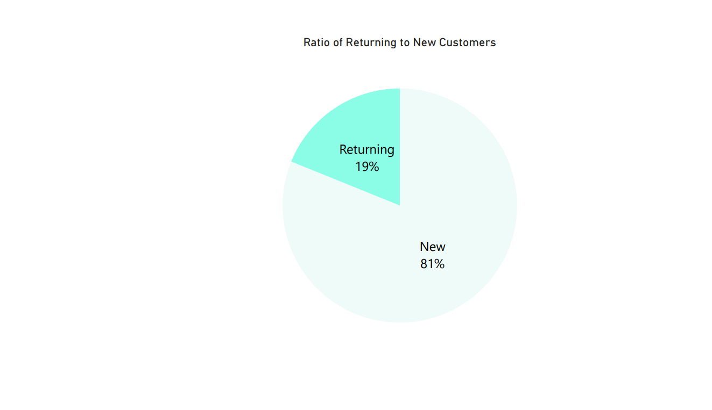
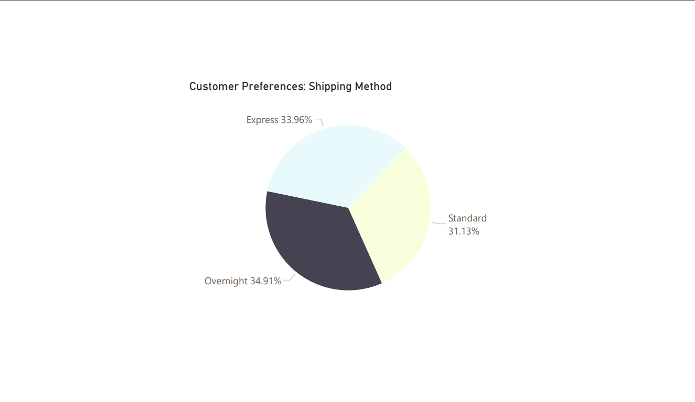

# Shopify Sales Dashboard

---


---

> 🚀 **Instant Plug-and-Play Shopify Dashboard**
>
> This analytics dashboard can be immediately connected to **any Shopify store**. Simply provide your Shopify credentials in the `.env` file, and your personalized sales dashboard will be ready in minutes.

---

## 📊 [View the Complete Shopify Dashboard](docs/shopify_dashboard.pdf)

---

## Quick Visual Preview


---

## Quick Navigation

### ⚡ Getting Started

- [Quick Start](#-quick-start)
- [Airflow Automation](#️-airflow-automation)
- [Running the Project](#️-running-the-project)
- [Running the Streamlit Dashboard](#-running-the-streamlit-dashboard)

### 📊 Data & Dashboards

- [Data Sources & ETL Pipeline](#-data-sources--etl-pipeline)
- [Power BI Integration](#-power-bi-integration)
- [Dashboard Screenshots](#️-dashboard-screenshots)
- [Toggle Between Real and Synthetic Data](#toggle-between-real-and-synthetic-data)

### 🚦 Integration Strategy

- [Shopify → HubSpot Integration (Standard)](#-shopify--hubspot-integration-standard)
- [PostgreSQL → HubSpot API Integration (Custom ETL)](#-postgresql--hubspot-api-integration-custom-etl)
- [HubSpot-Shopify Integration Steps](docs/hubspot_shopify_integration_steps.md)

### ⚙️ Technical Insights

- [Daily Data Generation (Simulated Shopify Data)](#-daily-data-generation-simulated-shopify-data)
- [Data Quality & Failure Simulation](#-data-quality--failure-simulation)
- [Automated Error Correction DAG](#️-automated-data-error-detection--correction-dag)

### 🛠️ Development & Contribution

- [Future Enhancements](#-future-enhancements)
- [Recent Updates](#-recent-updates)
- [Contributing](#-contributing)
- [License](#-license)

### 📖 Additional Information

- [Why Choose This Dashboard?](#-why-choose-this-dashboard-over-shopifys-built-in-analytics)
- [Analytical Insights & Human Behavior](#-note-on-analytical-insights--human-behavior)
- [Shopify API Reference](#-shopify-api-reference)
- [Troubleshooting](#️-troubleshooting)

---

## 🧭 Project Overview

The **Shopify Sales Dashboard** is a portfolio-ready analytics dashboard specifically designed for Shopify merchants and analytics professionals. It demonstrates end-to-end capabilities in data extraction, transformation, loading (ETL), and visualization, to answer practical business questions:

- **Sales Performance:** Quickly track total revenue, average order values (AOV), and top-performing products.
- **Customer Insights:** Analyze order patterns, repeat purchase rates, and customer segments.
- **Trends and Patterns:** Clearly visualize daily and monthly sales trends, enabling actionable business decisions around conversion and customer retention.

Built using **Python, Streamlit, PostgreSQL, and Airflow**, this project highlights modern data analytics skills, professional dashboard development, and practical business-oriented thinking.

---

## 🎯 Key Metrics & Business Questions Answered

This dashboard tracks essential e-commerce metrics and answers key business questions:

**Key Metrics:**

- 📈 **Total Sales Revenue**
- 🛒 **Average Order Value (AOV)**
- 📊 **Total Number of Orders**
- 💎 **Customer Lifetime Value (CLV)**
- 🔄 **Returning vs. New Customers**
- 🏅 **Top-selling Products**
- 🚀 **Sales Growth Rate (weekly/monthly)**

**Business Questions Answered:**

1. **Sales Performance:**

   - How are total sales trending over time?
   - What's the average order value (AOV), and is it improving?

2. **Customer Insights:**

   - Who are the most valuable customers (high CLV)?
   - What's the ratio of returning to new customers?

3. **Product Insights:**

   - Which products contribute most to revenue?
   - Are there clear seasonal trends or unexpected surges?

4. **Operational Effectiveness:**
   - Are discounts effectively driving sales?
   - Which shipping methods are customers preferring?

**Note:**  
Due to synthetic data constraints, some visualizations may initially appear less realistic. When connected to real Shopify data, the dashboard accurately and clearly addresses all questions outlined above.

---

## ⚡ Quick Start

Follow these simple steps to quickly set up and launch your **Shopify Sales Dashboard**:

### 📋 Requirements

- Python 3.8 or higher
- PostgreSQL
- Docker (recommended, but optional)

### 🔧 Setup Instructions

**1. Clone the Repository**

```bash
git clone https://github.com/NicolasLevesque/shopify-sales-dashboard.git
cd shopify-sales-dashboard
```

**2. Set Up Python Environment**

Create and activate a virtual environment:

```bash
python -m venv venv
source venv/bin/activate  # Linux/macOS
.\venv\Scripts\activate   # Windows
pip install -r requirements.txt
```

**3. Configure Environment Variables**

Copy the example x.envx file and configure your credentials:

```bash
cp .env.example .env
```

Update your `.env` file as follows:

```
# PostgreSQL Credentials
POSTGRES_DB=shopify_data
POSTGRES_USER=postgres
POSTGRES_PASSWORD=your-db-password
POSTGRES_HOST=localhost
POSTGRES_PORT=5432

# Shopify API Credentials (optional: synthetic data enabled by default)
USE_REAL_SHOPIFY_DATA=false
SHOPIFY_API_KEY=your_api_key
SHOPIFY_PASSWORD=your_api_password
SHOPIFY_STORE_NAME=your_store_name
```

**4. Launch the Project with Docker (Recommended)**

```bash
docker-compose up -d
```

(Optional) If you want to manually run ETL scripts outside of Airflow:

```bash
python scripts/real_shopify_etl.py
```

**5. Run the Streamlit Dashboard**

```bash
streamlit run app.py
```

Access your dashboard at [http://localhost:8501](http://localhost:8501).

---

## 📈 Features & Business Insights

The Shopify Sales Dashboard provides actionable analytics tailored explicitly to e-commerce business questions:

- **Conversion Rate Insights**: Clearly visualize and analyze product performance to identify top-converting products and categories.
- **Customer Retention Analysis**: Track and display the ratio of new versus returning customers, identifying key retention trends and high-CLV customers.
- **Revenue Trends & Seasonality**: Offer clear insights into sales trends, seasonal variations, and the impact of discounts on sales.
- **Operational Efficiency**: Visualize preferred shipping methods and the effectiveness of promotional strategies.

---

## 🛠️ Tech Stack

- **Programming:** Python, SQL
- **Data Processing:** Pandas, dbt, SQLAlchemy
- **Automation & Scheduling:** Apache Airflow
- **Databases:** PostgreSQL, Google BigQuery
- **Visualization:** Power BI, Tableau, Streamlit
- **API Integration:** Shopify REST API

---

## 📂 Project Structure

- **dags/**: Contains Airflow DAG files for scheduling tasks.
- **scripts/**: Holds ETL Python scripts for data extraction and processing.
- **dashboards/**: Storage location for Power BI/Tableau/Streamlit dashboard files.
- **data/**: Optional storage for raw or intermediate data files.
- **logs/**: Airflow-generated logs (not committed to GitHub).
- **config/**: Contains configuration-related files (e.g., Airflow settings).

---

## 📈 Toggle Between Real and Synthetic Data

This project supports both real Shopify data and synthetic data for development and testing purposes. You can switch between these data sources by modifying the `USE_REAL_SHOPIFY_DATA` environment variable in your `.env` file.

### Using Real Shopify Data:

- Set `USE_REAL_SHOPIFY_DATA=True` in your `.env` file.
- Ensure your Shopify API credentials are correctly configured in the `.env` file.
- Rebuild and restart your Docker containers to apply the changes:

```
docker-compose down
docker-compose up --build -d
```

### Using Synthetic Data:

- Set `USE_REAL_SHOPIFY_DATA=False` in your `.env` file.
- Rebuild and restart your Docker containers to apply the changes:

```
docker-compose down
docker-compose up --build -d
```

---

## 🚦 Integration Strategy

This project explicitly implements two distinct CRM integrations:

### ✅ Shopify → HubSpot Integration (Standard)

**Purpose:** Fast, user-friendly CRM synchronization.

- **Advantages:** Simple setup, minimal coding, robust built-in analytics.
- **Disadvantages:** Limited customization options.

### ✅ PostgreSQL → HubSpot API Integration (Custom ETL)

**Purpose:** Advanced control, customizable analytics pipeline.

- **Advantages:** Full customization, precise data transformation control.
- **Disadvantages:** Technical overhead, requires ongoing maintenance.

---

## ▶️ Running the Project

### Run ETL Manually

To manually run your ETL script (without Airflow):

```bash
python scripts/real_shopify_etl.py
```

Look for the confirmation message `✅ ETL Load Complete` in your console.

Verify data loaded successfully into your database:

```bash
docker exec -it shopify_sales_dashboard-postgres-1 psql -U airflow -d airflow

SELECT * FROM customers LIMIT 5;
SELECT * FROM orders LIMIT 5;
SELECT * FROM products LIMIT 5;
```

### Run ETL with Docker/Airflow

Launch your Docker environment and Airflow scheduler:

```bash
docker-compose up -d
```

Then, access the Airflow UI at [http://localhost:8500](http://localhost:8500), enable your DAG (`daily_real_shopify_data`), and trigger it manually or let it run on schedule.

---

## 📊 Running the Streamlit Dashboard

### Using Docker (Recommended)

If you're running your project with Docker Compose, the Streamlit dashboard automatically starts alongside Airflow:

- **Ensure your Docker containers are running**:

```bash
docker-compose up -d
```

- **Open your web browser and navigate to**:

[http://localhost:8501](http://localhost:8501)

This will display your interactive Streamlit dashboard connected directly to the PostgreSQL database, automatically reflecting new data from your Airflow pipeline.

---

### Without Docker (Manual Setup)

If you're running locally (without Docker):

- **Navigate to your dashboard directory** and run:

```bash
streamlit run app.py
```

- **Access the dashboard in your browser**:

[http://localhost:8501](http://localhost:8501)

Ensure your local environment is configured properly and your PostgreSQL instance is running.

---

## ⚙️ Airflow Automation

### Airflow Setup

1. **Software Dependencies:**

   - Docker & Docker Compose
   - Python (3.8+ recommended)
   - PostgreSQL (Docker-managed or standalone installation)

   Quick installation for Docker: [Install Docker](https://docs.docker.com/get-docker/)

2. **Start Docker Containers:**

   ```bash
   docker-compose up -d
   ```

3. **Verify Docker Containers:**

   ```bash
   docker ps
   ```

4. **Access Airflow Web Interface:**
   - Visit [http://localhost:8500](http://localhost:8500) and enable your DAG (`daily_real_shopify_data`).

### Scheduling

- **Default schedule:** Runs daily at midnight (`@daily`).
- **Customize schedule:** Edit the `schedule_interval` parameter in your DAG file (`daily_real_shopify_data.py`).

Example (run every 6 hours):

```bash
schedule_interval = '0 */6 * * *'
```

### Email Alerts

Set up email notifications for Airflow task failures:

1. **Configure SMTP settings** in your `.env`:

```bash
AIRFLOW__SMTP__SMTP_HOST=smtp.gmail.com
AIRFLOW__SMTP__SMTP_PORT=587
AIRFLOW__SMTP__SMTP_USER=your_email@gmail.com
AIRFLOW__SMTP__SMTP_PASSWORD=your_gmail_app_password
AIRFLOW__SMTP__SMTP_MAIL_FROM=your_email@gmail.com
```

2. **Add email settings** to your DAG (`daily_shopify_etl.py`):

```bash
default_args = {
  'email': ['your_email@gmail.com'],
  'email_on_failure': True,
}
```

---

## 📊 Data Sources & ETL Pipeline

**Data Source:**  
The project uses Shopify as its primary data source, leveraging the Shopify REST API to access sales, customer, and product data in real-time.

**ETL Pipeline:**  
The ETL process is managed by `scripts/real_shopify_etl.py`, which extracts data from Shopify, transforms and cleans it using Python and Pandas, and loads it into PostgreSQL.

- **Manual Execution:** Run locally with:

```bash
python scripts/real_shopify_etl.py
```

- **Airflow Automation:**  
  The Airflow DAG (`daily_real_shopify_data.py`) automates the ETL pipeline daily at midnight (`@daily`). The DAG runs the ETL script, monitors its success, and sends email notifications upon failure.

You can trigger or monitor the DAG via the Airflow web interface:

- URL: [http://localhost:8500](http://localhost:8500)

---

## 📊 Power BI Integration

This project integrates PostgreSQL data directly into Power BI for interactive visualization and analysis:

- **Data Connection**:  
  Established via Power BI's native PostgreSQL connector (hosted locally or via Docker).

- **Data Validation**:  
  Data accuracy and consistency validated by cross-checking PostgreSQL query outputs against visualizations in Power BI.

- **Interactive Dashboard**:  
  [📊 View Full Power BI Dashboard](docs/shopify_dashboard.pdf), clearly showcasing daily revenue, customer insights, product trends, and operational effectiveness.

---

## 📅 Daily Data Generation (Simulated Shopify Data)

To demonstrate and validate automated analytics capabilities without relying solely on a Shopify test store, the project includes a fully automated, daily-scheduled data generation pipeline using **Apache Airflow** and **Python’s Faker library**.

**What does this mean for the project?**

- Each day, realistic Shopify sales data (including randomized customer names, products, quantities, and pricing) is automatically appended to the dataset (`shopify_sales.csv`).
- The generated data is indistinguishable from typical real-world Shopify data, ensuring a robust demonstration environment for analytics and visualization.

### 🛠️ **How it works:**

- **Airflow DAG:**  
  Located at `dags/daily_shopify_data_generation.py`, this DAG generates daily fake transactions automatically.
- **Data Location:**  
  The generated data is stored directly in the PostgreSQL database (`synthetic_orders` table) and seamlessly integrates with existing dashboards and Airflow DAG workflows for efficient analytics and error correction.

### 🔄 **Daily Schedule:**

The default schedule for this data generation is set to run once per day (`@daily`). Customize the schedule by modifying the DAG’s `schedule_interval`.

**Example (run hourly):**

```python
schedule_interval = '@hourly'
```

This automation clearly highlights the project’s scalability and real-world applicability, offering a robust demonstration of daily-updated analytics workflows.

### Example Data Generated by Project

Below is a realistic sample of the synthetic Shopify orders data, (including generated errors (future dates, negative quantities, and missing prices), though currently the errors are being automatically corrected):

| order_id | order_date | customer_name      | customer_email              | product             | quantity | price | total_price | shipping_method | discount_code | taxes | shipping_cost | discount_amount | is_error |
| -------- | ---------- | ------------------ | --------------------------- | ------------------- | -------- | ----- | ----------- | --------------- | ------------- | ----- | ------------- | --------------- | -------- |
| 1073     | 2025-04-02 | Shane Nichols      | lopezjoshua@example.net     | Water Bottle        | 5        | 12.00 | 81.02       | Overnight       | WELCOME10     | 7.02  | 20.00         | 6.00            | False    |
| 1040     | 2025-04-02 | Kristopher Peck    | dominguezdeanna@example.com | Travel Mug          | 1        | 15.00 | 15.75       | Standard        | NULL          | 0.75  | 0.00          | 0.00            | False    |
| 1071     | 2025-04-02 | Megan Barnes       | carmenvaldez@example.com    | Portable Hard Drive | 4        | 45.00 | 189.00      | Standard        | NULL          | 9.00  | 0.00          | 0.00            | False    |
| 1072     | 2025-04-02 | Michael Simon      | pattersondiane@example.net  | Water Bottle        | 5        | 12.00 | 56.70       | Standard        | WELCOME10     | 2.70  | 0.00          | 6.00            | False    |
| 1038     | 2025-04-02 | James Thompson     | nicholas08@example.org      | Laptop Sleeve       | 1        | 18.00 | 17.01       | Standard        | WELCOME10     | 0.81  | 0.00          | 1.80            | False    |
| 1039     | 2025-04-02 | Raymond Walsh      | kgutierrez@example.org      | Water Bottle        | 4        | 12.00 | 60.40       | Express         | NULL          | 2.40  | 10.00         | 0.00            | False    |
| 1069     | 2025-04-02 | Christina Adams    | julie01@example.org         | USB-C Charger       | 4        | 10.00 | 62.00       | Overnight       | NULL          | 2.00  | 20.00         | 0.00            | False    |
| 1070     | 2025-04-02 | Heather Wilcox     | harrisonkristin@example.org | Portable Hard Drive | 1        | 45.00 | 67.25       | Overnight       | NULL          | 2.25  | 20.00         | 0.00            | False    |
| 1037     | 2025-04-02 | Jeffrey Marquez    | garzajavier@example.org     | Yoga Mat            | 2        | 30.00 | 84.80       | Overnight       | NULL          | 4.80  | 20.00         | 0.00            | False    |
| 1041     | 2025-04-02 | Jacqueline Johnson | gobrien@example.com         | Desk Organizer      | 2        | 22.00 | 66.20       | Overnight       | NULL          | 2.20  | 20.00         | 0.00            | False    |

- ✅ `updated_at` timestamps are now automatically set via Airflow after each daily data generation run.

---

## 🩺 Data Quality & Failure Simulation

In real-world data pipelines, unexpected issues can arise—such as incomplete rows, invalid dates, or negative quantities. To demonstrate robust data engineering practices, **this project introduces a small chance (~10%) of “bad data”** during daily synthetic order generation:

- **Examples of Induced Errors**:
  - **Missing or Negative Price** – Represents failed calculations or missing fields.
  - **Future Order Date** – Simulates incorrect timestamps or time-zone quirks.
  - **Negative Quantity** – Mimics data entry errors or faulty external integrations.

Each problematic row is marked with a boolean flag, `is_error = TRUE`, so you can easily **isolate** and **remediate** them—mirroring real-world data quality workflows (e.g., quarantining bad records, applying correction scripts, or sending alerts). The pipeline **still runs** seamlessly, showcasing how to handle data anomalies gracefully without halting the entire ETL process.

- 💡 **Simulated “failures”** reveal how you might track and fix flawed input.
- ⚙️ **No disruption** to the main pipeline—only flagged rows need cleanup if desired.

---

## 🛠 Automated Data Error Detection & Correction DAG

An Airflow DAG (`fix_shopify_data_errors`) is implemented to automatically detect and correct simulated data errors introduced during daily synthetic data generation:

**✅ Automated Error Types Corrected:**

- **Future Order Dates** – Adjusted to today's date to ensure accuracy.
- **Negative Quantities** – Corrected by converting to absolute (positive) values.
- **Missing Prices** – Filled in with realistic, product-based average prices.

Each correction is clearly logged in Airflow task logs for easy monitoring and verification.

**Schedule**: Automatically triggered daily after the data generation DAG completes.

**Usage**: Monitor corrections directly in Airflow's UI or through your dashboard's visual analytics, ensuring data reliability and integrity.

---

## Why Choose This Dashboard over Shopify's Built-In Analytics?

This dashboard provides clear advantages over Shopify's built-in analytics:

- **Customizable Dashboard** tailored specifically to your unique Shopify store analytics needs.
- **Complete Data Ownership**—Store your data locally, export freely, and integrate with external CRM or reporting tools.
- **Automated Daily ETL Workflows**—Reliable daily updates using Apache Airflow without manual intervention.
- **Affordable, One-Time Cost**—No ongoing subscription or monthly fees.
- **Synthetic Data Generation & Error Correction**—Clearly demonstrated ETL pipeline robustness and automation capabilities.

**Upcoming Features (Currently in Development):**

- 🎯 Advanced Customer Segmentation (RFM Analysis)
- ⚠️ Automated Anomaly Detection & Alerts
- 📈 Predictive Analytics & Forecasting
- 🔄 Enhanced CRM Integrations and More

---

## 🔍 Note on Analytical Insights & Human Behavior

This dashboard uses synthetic data generated daily for the purpose of demonstrating technical automation, analytics pipelines, and visualization capabilities.

### While effective for showcasing technical processes, synthetic data does not inherently reflect authentic human psychological patterns, motivations, or behaviors. Genuine psychological insights and strategic recommendations require validation and analysis of authentic customer data.

---

## 🖥️ Dashboard Screenshots

Below are screenshots clearly showcasing the Shopify Sales Dashboard features:

**Sales & Revenue Trends:**

_Clearly illustrates monthly and seasonal revenue patterns, emphasizing product performance._

**Customer Insights:**

_Detailed view of customer segmentation, highlighting new vs returning customer ratios._

**Operational Insights:**

_Dashboard visual showing the effectiveness of discounts and shipping method preferences._

---

## 📡 Shopify API Reference

### Authentication & Example API Call

The dashboard uses Shopify's REST API with an admin access token:

```bash
GET https://{SHOP_NAME}.myshopify.com/admin/api/2023-10/orders.json
Headers:
  X-Shopify-Access-Token: {ADMIN_ACCESS_TOKEN}
```

**Python Example:**

```bash
import requests
import os

SHOP_NAME = os.getenv("SHOP_NAME")
ADMIN_ACCESS_TOKEN = os.getenv("ADMIN_ACCESS_TOKEN")

url = f"https://{SHOP_NAME}.myshopify.com/admin/api/2023-10/orders.json"
headers = {"X-Shopify-Access-Token": ADMIN_ACCESS_TOKEN}

response = requests.get(url, headers=headers)
data = response.json()

print(data)
```

### API Endpoints

The dashboard uses these Shopify API endpoints:

- **Orders:** `/orders.json` (Sales data)
- **Customers:** `/customers.json` (Customer insights)
- **Products:** `/products.json` (Product data & inventory)

All endpoints use the base URL:

```bash
https://{SHOP_NAME}.myshopify.com/admin/api/2023-10/
```

---

## ⚠️ Troubleshooting

**1. PostgreSQL Connection Issues**

- Double-check your `.env` file (`POSTGRES_HOST`, credentials).
- Docker host: use `postgres` or `host.docker.internal`.

**2. Authentication Failed (Shopify API)**

- Verify your `SHOP_NAME` and `ADMIN_ACCESS_TOKEN` in `.env`.

**3. DAG Not Visible in Airflow**

- Ensure the DAG file (`daily_real_shopify_data.py`) is in your `dags/` folder.
- Restart your Airflow containers (`docker-compose restart`).

**4. Email Alerts Not Sending**

- Confirm SMTP settings in `.env` and Airflow default_args (`email_on_failure=True`).

---

## 🚧 Future Enhancements

- ✨ **AI-driven sales forecasting** leveraging historical synthetic data
- 🔌 Integration with external data sources (**Google Analytics, Stripe**)
- 🛒 Expansion to additional e-commerce platforms (**WooCommerce, Amazon**)
- ⚙️ **Advanced DAG orchestration** (parallel tasks, complex workflows)
- 💬 **Slack notifications** for key pipeline events & automated error fixes
- 📊 **Dashboard deployment** with Power BI, Tableau, or Streamlit for richer analytics

---

## Recent Updates

- ✅ **Implemented automated error correction DAG** (future dates, negative quantities, missing prices)
- ✅ **Switched from CSV storage to PostgreSQL** for improved scalability and data integrity
- ✅ **Enhanced data generation realism** (simulated errors, accurate product/customer behavior)
- ✅ **Improved README clarity and accuracy** reflecting the project's current state
- ✅ **Verified and updated the `updated_at` column logic for synthetic_orders**, ensuring clear timestamps updates via Airflow DAG.

---

## 🤝 Contributing

Contributions are welcome and encouraged! To contribute clearly and effectively, please follow these guidelines:

1. **Fork** the repository and create your feature branch:

```bash
git checkout -b feature/YourFeatureName
```

2. **Commit** your changes with clear and descriptive commit messages:

```bash
git commit -m 'Add clear description of YourFeature'
```

3. **Push** your changes to your forked feature branch:

```bash
git push origin feature/YourFeatureName
```

4. Submit a **Pull Request** clearly describing the purpose and impact of your changes.

Thank you for helping improve the project!

---

## 📜 License

Distributed under the MIT License. See `LICENSE.MD` for more information.
